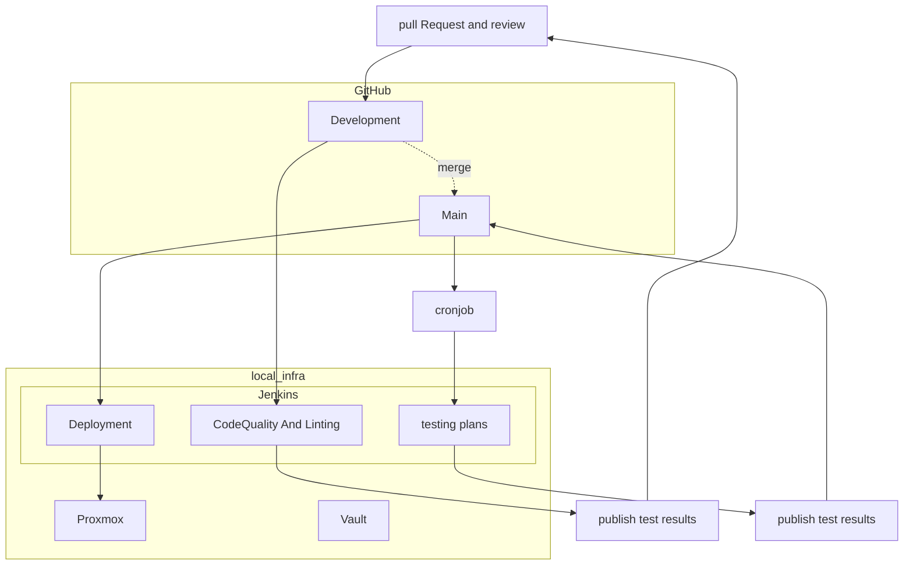

# DevOps

| [Guides](https://ji-podhead.github.io/DevOps/)  |  [Projects](https://github.com/ji-podhead/DevOps/blob/main/readme.md#projects)  |

      

This is my DevOps Repo.    This serves as my Playground, Portfolio, Research-Notebook, Cheat-Sheet and Guide.

## Guides 

 - [TerrForm & Vault](https://ji-podhead.github.io/DevOps/guides/terraform&vault/)
 - [static configuration scanners, Rules, and Test Results](https://ji-podhead.github.io/DevOps/automatic_checks)
 - [Terraform & Proxmox](https://ji-podhead.github.io/DevOps/guides/terraform%26proxmox)  

---

## Projects 

### 1. Static Website CI-CD Pipeline

| [Repo](https://github.com/ji-podhead/ji-podhead-blog) |

- we deploy a static react app via terraform to gh-pages

### 2. The Pod Shop

| [AppConfigs](https://github.com/ji-podhead/Pod-Shop-App-Configs/blob/main/README.md) | [SourceCode](https://github.com/ji-podhead/Pod-Shop-SourceCode) |

This is my first cluster based DevOps project that includes CI-CD and gitops principles.

- We have a simple Web App with a  forum and rtmp stream of a win95 vm that runs dooms ⛓️‍💥
	- we use Microservices via gRPC, kubevirt for virtualisation and react as frontend
- k8s cluster is selfhosted via proxmox
 	- we will use Tailscale Github Actions Integration instead of ssh to deploy to our k8s cluster 
- IAC,k8s and other app configs have [their own repo](https://github.com/ji-podhead/Pod-Shop-App-Configs/blob/main/README.md) -> *gitops best practices* 
- sensitive data will get managed by vault and gh secrets
- we have an external jenkinspipeline for our test plans that get triggered via webhook and sheduled jobs in gh actions
- we report back to github (out central "CI-CD" service 🕵️) and publish our tests and report back to github
 	- we use gh actions plugins like  [publish reports](https://github.com/marketplace/actions/publish-test-results) to create a status report section (including markdown summary)
  	- we setup a bot that reports via gh and messaging service like slack      
- elastic stack will be our main SIEM

 

So from my understanding, there a no Best Practices for every project...
It took me a while to get started...
but thanks to excellent help and support from [@mkunikow](https://github.com/mkunikow) via [devops discord channel](https://discord.com/invite/devops-sre-infrastructure-419745677585940482) I could get a better understanding of modern CI-CD and how to approach my project. 
 

---
### CI-CD Pipeline

### Release Management & Test Scheduling
***successfull Production-Commits will be pushed to `release-candidate` Branch***

| Phase | Description | Branch | Crontab Time |
|---|---|---|---|
| Development | Commits trigger Jenkins CI-CD pipeline | production | * * * * * |
| IAC | Scanns the App Configuration folder | test | * * * * * |
| Compliance | Compliance Checks, IAM Policy Validation, Network Policy Enforcement, Topology Verification | test |  0 */4 * * * |
| WebSecurity | Running Web and Application Security Tests to avoid hacks like xss | test |  0 */4 * * * |
| Integration | Executing Integration Tests (Back & Frontend) | test | 0 16,22 * * * |
| Performance | Cluster-wide back- and frontend performance test  | test |  30 16,22 * * * |
| Build | Building the final version of the application for release | release-candidate | 0 23 * * * |
| Release | Deploying the built application to production | production & release | 0 0 * * * |

---
