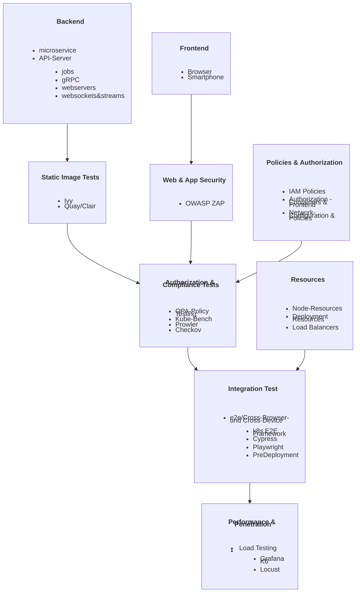

# DevOps
This is my DevOps - Repo. This serves as my Playground, Portfolio, Research-Notes, Cheat-Sheet and Guide. 

## Topics
- IAC with Terraform
- CICD-serving with Jenkins
- CI with Packer,Gitea and Github-Actions
- CD with Argo-CD
- Automated Security Testing
- Virtualisation with Kubevirt
- Monitoring & Logging with Grafana, Kafka & OpenTelemetry
- Authorisation with Vault Github-Secrets and Oauth-Proxy
- Streaming with NGINX RTMP Module and gRPC
- StatefulSets, Monoliths & Microservices
- RateLimiting, realtime threat-detection & Vulnabillity-Scanning 

---

## CI-CD Pipeline
### Basis Infrastructure Deployment
- we initialize our k8s cluster, branches, set up our monoliths and install our tools
- k8s network policies & topology 
- user & administration
- basis iam policies
- ingress, dashboards, host- names&mapping, dns, firewall & persistent storage
- ***IAC-Basis-Configuration Check*** 
### Source Control & Integration
> triggered by commit to Integration Branch
-  static checks before triggering pipeline 
	- Sast, Dast & Linters
### Build
- IAC-Codequality & misconfiguration Checks 
> can also be used while writing terraform code

	- Chekov 
	- trivy
	
- build based on parameters & multiple stages
>	not every change need to trigger every component

- push into Test Branch

### Test 
>  Triggered by pushing into Test-Branch

- sending pull Request Testing->Main/Production Branch
- awaiting manual Approval
### Deploy
> based on parameters & Infrastructure

  
### Monitoring & Feedback
- telemtry & logs
	- kafka
	- OpenTelemetry
- devSecOps:
	- Suricata
	- Snort
	- OSSEC
	- Falco

---
