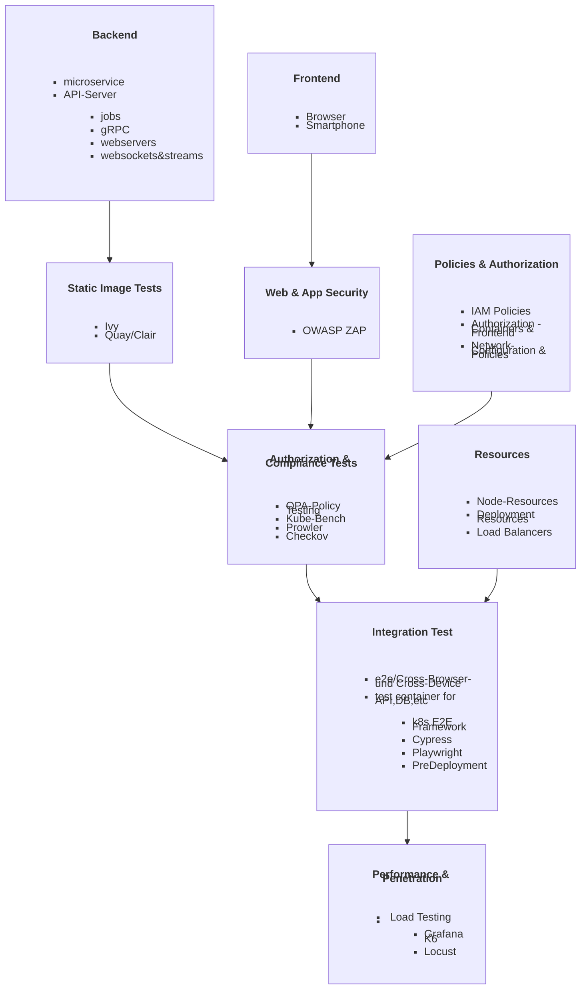

# DevOps

<div align="center">
      
</div>

| [Guides](https://ji-podhead.github.io/DevOps/)  |  [Projects](https://github.com/ji-podhead/DevOps/)  |

This is my DevOps Repo.  <br> This serves as my Playground, Portfolio, Research-Notebook, Cheat-Sheet and Guide. 

---

## Projects 

### 1. Static Website CI-CD Pipeline

| [Repo](https://github.com/ji-podhead/ji-podhead-blog) |

- we deploy a static react app via terraform to gh-pages

### 2. The Pod Shop

| [AppConfigs](https://github.com/ji-podhead/Pod-Shop-App-Configs/blob/main/README.md) | [SourceCode](https://github.com/ji-podhead/Pod-Shop-SourceCode) |


This is my first cluster based DevOps project that includes CI-CD and gitops principles.

- We have a simple Web App with a  forum and rtmp stream of a win95 vm that runs dooms ⛓️‍💥
	- we use Microservices via gRPC, kubevirt for virtualisation and react as frontend
- k8s cluster is selfhosted via proxmox
 	- we will use Tailscale Github Actions Integration instead of ssh to deploy to our k8s cluster 
- IAC,k8s and other app configs have [their own repo](https://github.com/ji-podhead/Pod-Shop-App-Configs/blob/main/README.md) -> *gitops best practices* 
- sensitive data will get managed by vault and gh secrets
- we have an external jenkinspipeline for our test plans that get triggered via webhook and sheduled jobs in gh actions
- we report back to github (out central "CI-CD" service 🕵️) and publish our tests and report back to github
 	- we use gh actions plugins like  [publish reports](https://github.com/marketplace/actions/publish-test-results) to create a status report section (including markdown summary)
  	- we setup a bot that reports via gh and messaging service like slack      
- elastic stack will be our main SIEM

 

So from my understanding, there a no Best Practices for every project...
It took me a while to get started...
but thanks to excellent help and support from [@mkunikow](https://github.com/mkunikow) via [devops discord channel](https://discord.com/invite/devops-sre-infrastructure-419745677585940482) I could get a better understanding of modern CI-CD and how to approach my project. 
 


---

### Release Management & Test Scheduling
***successfull Production-Commits will be pushed to `release-candidate` Branch***

| Phase | Description | Branch | Crontab Time |
|---|---|---|---|
| Development | Commits trigger Jenkins CI-CD pipeline | production | * * * * * |
| IAC | Scanns the App Configuration folder | test | * * * * * |
| Compliance | Compliance Checks, IAM Policy Validation, Network Policy Enforcement, Topology Verification | test |  0 */4 * * * |
| WebSecurity | Running Web and Application Security Tests to avoid hacks like xss | test |  0 */4 * * * |
| Integration | Executing Integration Tests (Back & Frontend) | test | 0 16,22 * * * |
| Performance | Cluster-wide back- and frontend performance test  | test |  30 16,22 * * * |
| Build | Building the final version of the application for release | release-candidate | 0 23 * * * |
| Release | Deploying the built application to production | production & release | 0 0 * * * |


---
## App Configuration Repo Structure
***--> This is just a roadmap***
- we trigger jenkins jobs using changesets, hence we need to provide a filestructure to make this simpler
```yaml
/my-iac-project
├── .gitignore
├── README.md
├── terraform
│   ├── main.tf
│   ├── variables.tf
│   ├── outputs.tf
│   └── modules
│       ├── k8s
│       │   ├── main.tf
│       │   ├── variables.tf
│       │   └── outputs.tf
│       └── cassandra
│           ├── main.tf
│           ├── variables.tf
│           └── outputs.tf
├── jenkins
│   ├── Jenkinsfile
│   └── pipeline-scripts
│       ├── build-script.sh
│       └── deploy-script.sh
├── grpc
│   ├── proto
│   │   └── myservice.proto
│   └── src
│       └── myservice
│           ├── myservice_server.go
│           └── myservice_client.go
```

---

## Notes
- initially planned topics and features:
> - IAC with Terraform
> - CICD-serving with Jenkins
> - CI with Packer,Gitea and Github-Actions
> - CD with Argo-CD
> - Automated Security Testing
> - Virtualisation with Kubevirt
> - Monitoring & Logging with Grafana, Kafka & OpenTelemetry
> - Authorisation with Vault Github-Secrets and Oauth-Proxy
> - Streaming with NGINX RTMP Module and gRPC
> - StatefulSets, Monoliths & Microservices
> - RateLimiting, realtime threat-detection & Vulnabillity-Scanning 
> - first approach for cicd testing stage:
  

